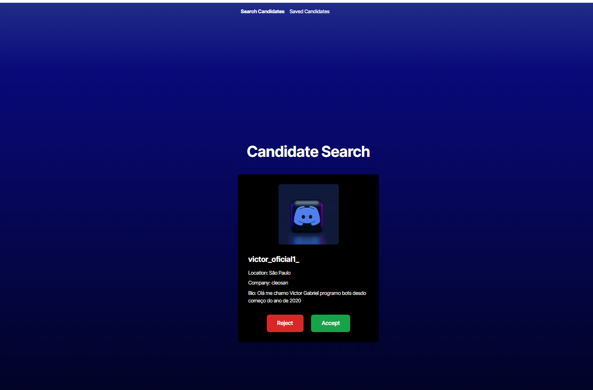

# Candidate Search

## Websites: 
[GitHub Link](https://github.com/noIDEA-tech/13-React-TS-Candidate-Search-New/tree/main/Develop)

[Render Link](https://https-github-com-noidea-tech-13-react-ts.onrender.com)

## Description
This is a Candidate Search App that uses an API to retrieve User data from the GitHub API  for the purpose of searching for and saving potential candidates to employ.

## Rendered Application Images

## Table of Contents
- [Installation](#installation)
- [Usage](#usage)
- [Credits](#credits)
- [License](#license)
- [Features](#features)
- [Tests](#tests)
- [Contact](#contact)

## Installation
* npm i
* npm install @types/react @types/react-dom --save-dev
* npm install @vitejs/plugin-react
* npm install -D tailwindcss postcss autoprefixer
* npx tailwindcss init -p

## Configuration
* Create a GitHub Personal Access Token
* Create .env file in the environment folder
* Add your GitHub token to .env as: VITE_GITHUB_TOKEN=your_token_here

## Deployment (Render)
* Build Command: `npm install && npm run build`
* Start Command: `npm run start`
* Environment Variables Required:
  - VITE_GITHUB_TOKEN

For detailed deployment instructions, refer to the [Render deployment guide](https://coding-boot-camp.github.io/full-stack/render/render-deployment-guide)

## Usage
* npm run dev
* npm run build

## Credits
Nancy Watreas Feltman;  
This project was developed with the assistance of Claude AI (Anthropic). Claude provided guidance on:
- React and TypeScript implementation
- Component styling with Tailwind CSS
- GitHub API integration
- Debugging and troubleshooting

## License
MIT

## Features
The Candidate Search App displays a single candidate on the `Candidate Search` page and includes the candidate's name, username, location, avatar, email, html_url, and company information. Directly below the candidate's GitHub user information are two buttons -  `Accept`and `Reject` which allow the user to either save a potential candidate by clicking the `Accept` button or move to the next candidate by clicking the `Reject` button. The navigation bar allows users to navigate to and from `Candidate Search` to `Saved Candidates`. Potential candidates are saved in local storage which allows users to review candidates as needed or remove them from their list.

## Tests
npm run build, npm run dev

## Contact
If there are any questions or concerns, I can be reached at:
##### [github: noIDEA-tech](https://github.com/noIDEA-tech)
##### [email: nwatreas2023@gmail.com](mailto:nwatreas2023@gmail.com)
